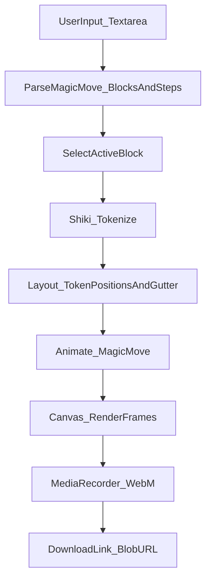

# Magic Move → Video (MVP) — Usage & Internals

This app lets you paste **Slidev-style Shiki Magic Move** markdown and export an animated **WebM** video of the code morphing between steps.

Reference feature: Slidev “Shiki Magic Move”.

## What you can do

- Paste one or more **magic-move blocks** into the textarea
- Select which block to preview/export (when multiple exist)
- Preview the animation (Play/Pause/Reset)
- Export a **downloadable `.webm`** video
- Use **line numbers** via `{lines:true}` and `{startLine:n}`

## Supported input formats

### Option A: Slidev-style `shiki-magic-move` (recommended)

Use **4 backticks** for the wrapper, and put multiple **triple-backtick** code fences inside.

```md
````shiki-magic-move {lines:true,startLine:5}
```ts
function add(a: number, b: number) {
  return a + b
}
```

```ts
function add(a: number, b: number) {
  const sum = a + b
  return sum
}
```
````
```

- **Outer meta** like `{lines:true,startLine:5}` applies to all steps by default.
- Each inner code fence can override meta, e.g.:
  - ````md
  ```ts {lines:true,startLine:10}
  // ...
  ```
  ````

### Option B: Slidev docs `md magic-move`

```md
````md magic-move
```js
console.log(`Step ${1}`)
```
```js
console.log(`Step ${1 + 1}`)
```
```ts
console.log(`Step ${3}` as string)
```
````
```

### Multiple blocks in one input

You can include multiple magic-move blocks (and any other markdown like slide separators `---`).
The app will show a **Sequence** dropdown so you can choose which block to preview/export.

## Line numbers (Slidev-like)

To enable per-step line numbering:

```md
```ts {lines:true,startLine:5}
// line 5
// line 6
```
```

Or enable for all steps in a block:

```md
````shiki-magic-move {lines:true,startLine:5}
...
````
```

## Preview vs Export behavior (long code blocks)

- **Preview**: The canvas grows vertically to fit the longest step in the selected block, and the preview container is scrollable.
- **Export**: The canvas height is fixed at the start of recording (based on the longest step) so the video includes **all lines** with no clipping.

## How it works (high level)



## Key files / modules

- **UI / wiring**
  - `app/page.tsx`
    - Parses input into blocks
    - Lets user select a block
    - Drives preview playback timeline
    - Drives export rendering + recording

- **Parsing**
  - `app/lib/magicMove/parseMagicMove.ts`
    - Finds ` ````shiki-magic-move ... ```` ` and ` ````md magic-move ... ```` `
    - Extracts inner triple-backtick code fences as steps
    - Supports multiple blocks in one document
  - `app/lib/magicMove/parseLineMeta.ts`
    - Parses `{lines:true,startLine:n}` from outer/inner meta
    - Inner meta overrides outer meta when explicitly specified

- **Highlighting**
  - `app/lib/magicMove/shikiHighlighter.ts`
    - Loads Shiki (`github-dark` / `github-light`)
    - Tokenizes code into colored tokens
    - Includes language fallback to plain `text` if a language is missing

- **Layout + rendering**
  - `app/lib/magicMove/codeLayout.ts`
    - Converts token lines into positioned tokens for the canvas
    - Calculates dynamic canvas height for long blocks
  - `app/lib/magicMove/canvasRenderer.ts`
    - Draws the background “card”, gutter, and tokens
    - Uses `ctx.canvas.width/height` to avoid clipping when height changes

- **Animation**
  - `app/lib/magicMove/animate.ts`
    - Naive token matching by `(tokenText, occurrenceIndex)` between steps
    - Unmatched tokens fade out/in

- **Recording**
  - `app/lib/video/recordCanvas.ts`
    - Records `canvas.captureStream(fps)` using `MediaRecorder`
    - Uses higher `videoBitsPerSecond` defaults for better quality

## Notes / limitations (current MVP)

- Export format is **WebM** (MP4 would require ffmpeg, typically server-side).
- “Magic move” matching is a pragmatic heuristic (good for many refactors, not perfect for all diffs).
- Line highlighting markers like `{*|*}` are currently ignored for rendering (safe to keep in input).

## Troubleshooting

- **No blocks found**
  - Ensure you used **4 backticks** on the wrapper and **3 backticks** for each step.
  - Use one of:
    - ` ````shiki-magic-move ... ```` `
    - ` ````md magic-move ... ```` `

- **Video looks blurry**
  - The app records at **1920×(dynamic height)** and uses a higher bitrate, but quality still depends on browser codec support.
  - VP9 usually yields best quality; the recorder falls back to VP8 if needed.


